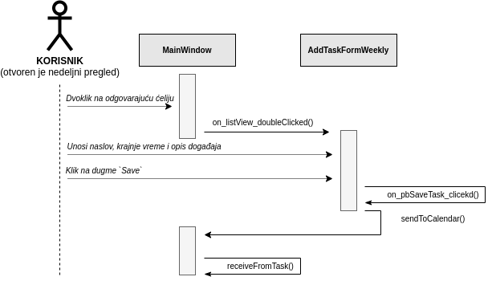

# Specifikacija - TUDU Drag & Drop Planner

## Kratak opis

TUDU je nedeljni drag & drop planer, sa integrisanom listom obaveza (todo listom). Uz pomoć ove aplikacije možete organizovati svoje planove na pregledan  i sitematizovan način.

U listu obaveza se dodaju sve obaveze koje planirate da obavite u narednom periodu i zatim im se dodeljuje prioritet, tako da imate sistematizovan spisak obaveza koji omogućava da nikad ne zaborative na bitan sastanak, porodični ručak ili neku drugu obavezu.

Iz liste obaveze možete premestiti u nedeljni kalendar i tako na pregledan način u svakom trenutku videti šta vas očekuje ove, ili bilo koje naredne nedelje.

## Uputstvo za izgradnju koda:

- Preuzeti i instalirati Qt Creator - [Online Installer](https://www.qt.io/download-qt-installer) ili [Source Code](https://www.qt.io/download-open-source)
- Klonirati direktorijum na računar `git clone https://gitlab.com/matf-bg-ac-rs/course-rs/projects-2020-2021/05-tudu.git`
- Otvoriti `tudu.pro` iz kloniranog direktorijuma u programu Qt Creator
- Pokrenuti program u razvojnom okruženju `Ctrl + R`

## Dijagram slučajeva upotrebe

## Slučaj upotrebe - unos novog događaja

(+ odgovarajući dijagrami sekvenci)

**Opis:** Korisnik unosi novi događaj u nedeljni pregled

**Pretpostavke:** Pokrenuta aplikacija, otvoren nedeljni pregled

**Ishodi:** Željeni događaj se na odgovarajuć način prikazuje u nedeljnom pregledu

**Tok:**

- Korisnik (dvoklikom na odgovarajuću ćeliju) bira vreme i dan u nedeljnom pregledu kada željeni digađaj počinje
- Otvara se prozor koji sadrži formu za unos/ažuriranje događaja
  - Korisnik unosi naslov događaja
  - Vreme početka događaja je automatski učitano
  - Korisnik unosi vreme kraja događaja
  - Korisnik (opciono) unosi opis događaja
  - Korisnik klikće na dugme `Save`
- Aplikacija na odgovarajuć način čuva željeni događaj
- Aplikacija adekvatno prikazuje dodati događaj u nedeljnom pregledu 

**Dijagram sekvenci:**

## Dijagram glavnih implementiranih klasa

## Demo snimak

:movie_camera: Demo snimak možete pogledati na sledećem **[linku](https://youtu.be/BZ75_l5egiE)**.