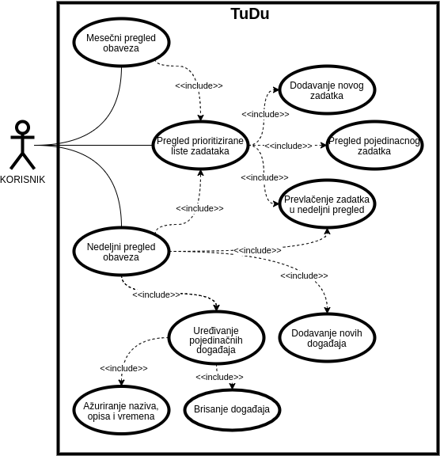

# Specifikacija - TUDU Drag & Drop Planner

## Kratak opis

TUDU je nedeljni drag & drop planer, sa integrisanom listom obaveza (todo listom). Uz pomoć ove aplikacije možete organizovati svoje planove na pregledan  i sitematizovan način.

U listu obaveza se dodaju sve obaveze koje planirate da obavite u narednom periodu i zatim im se dodeljuje prioritet, tako da imate sistematizovan spisak obaveza koji omogućava da nikad ne zaborative na bitan sastanak, porodični ručak ili neku drugu obavezu.

Iz liste obaveze možete premestiti u nedeljni kalendar i tako na pregledan način u svakom trenutku videti šta vas očekuje ove, ili bilo koje naredne nedelje.

## Uputstvo za izgradnju koda:

- Preuzeti i instalirati Qt Creator - [Online Installer](https://www.qt.io/download-qt-installer) ili [Source Code](https://www.qt.io/download-open-source)
- Klonirati direktorijum na računar `git clone https://gitlab.com/matf-bg-ac-rs/course-rs/projects-2020-2021/05-tudu.git`
- Otvoriti `tudu.pro` iz kloniranog direktorijuma u programu Qt Creator
- Pokrenuti program u razvojnom okruženju `Ctrl + R`

## Dijagram slučajeva upotrebe

## Slučajevi upotrebe

### Unos taska u Tudu listu

**Opis:** Korisnik unosi novi task u Tudu listu

**Pretpostavke:** Pokrenuta aplikacija

**Ishodi:** Željeni task se na odgovarajuć način prikazuje u Tudu listi

**Tok:**

- Korisnik klikom na dugme `Add task` započinje dodavanje taska
- Otvara se prozor koji sadrži formu za unos taska
  - Korisnik unosi naslov i prioritet
  - Korisnik opciono unosi opis
  - Korisnik klikće na dugme `Save`
- Aplikacija na odgovarajuć način čuva željeni task
- Aplikacija adekvatno prikazuje dodati task u Tudu listi

### Ažuriranje taska

**Opis:** Korisnik azurira proizvoljan task u Tudu listi

**Pretpostavke:** Pokrenuta aplikacija

**Ishodi:** Željeni task menja podatke koji se u njemu nalaze

**Tok:**

- Korisnik dvoklikom na task započinje ažuriranje
- Otvara se prozor koji sadrži formu za ažuriranje taska
  - Korisnik menja naslov, prioritet i/ili opis
  - Korisnik klikće na dugme `Save`
- Aplikacija na odgovarajuć način čuva izmenjen task

### Prebacivanje taska iz Tudu liste

**Opis:** Korisnik task iz tudu liste prebacuje u nedeljni pregled

**Pretpostavke:** Pokrenuta aplikacija, otvoren nedeljni pregled

**Ishodi:** Željeni događaj se prikazuje na odgovarajucem mestu u nedeljnom pregledu

**Tok:**

- Korisnik pozicionira kursor na željeni task i klikne i drži
- Korisnik prevlači task na odgovarajuce mesto u nedeljnom pregledu
- Aplikacija na odgovarajuć način čuva željeni događaj
- Aplikacija adekvatno prikazuje dodati događaj u nedeljnom pregledu

### Unos novog događaja

**Opis:** Korisnik unosi novi događaj u nedeljni pregled

**Pretpostavke:** Pokrenuta aplikacija, otvoren nedeljni pregled

**Ishodi:** Željeni događaj se na odgovarajuć način prikazuje u nedeljnom pregledu

**Tok:**

- Korisnik (dvoklikom na odgovarajuću ćeliju) bira vreme i dan u nedeljnom pregledu kada željeni digađaj počinje
- Otvara se prozor koji sadrži formu za unos/ažuriranje događaja
  - Korisnik unosi naslov događaja
  - Vreme početka događaja je automatski učitano
  - Korisnik unosi vreme kraja događaja
  - Korisnik (opciono) unosi opis događaja
  - Korisnik klikće na dugme `Save`
- Aplikacija na odgovarajuć način čuva željeni događaj
- Aplikacija adekvatno prikazuje dodati događaj u nedeljnom pregledu 

### Prlazak iz mesečnog pregleda u nedeljni pregled

**Opis:** Korisnik prelazi iz mesečnog pregleda u nedeljni pregled

**Pretpostavke:** Pokrenuta aplikacija, otvoren mesečni pregled

**Ishodi:** Korisnik se nalazi u nedeljnom pregledu

**Tok:**

- Korisnik pozicionira kursor na željeni dan u mesečnom pregledu i dvoklikne na njega
- Aplikacija otvara karticu sa nedeljnim pregledom i obeležava polje odabranog dana na mestu trenutnog vremena korisnikove mašine

## Dijagram glavnih implementiranih klasa

## Demo snimak

:movie_camera: Demo snimak možete pogledati na sledećem **[linku](https://youtu.be/BZ75_l5egiE)**.
